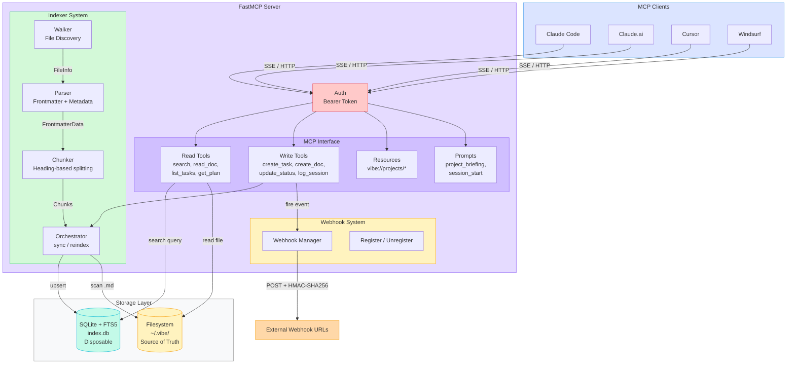
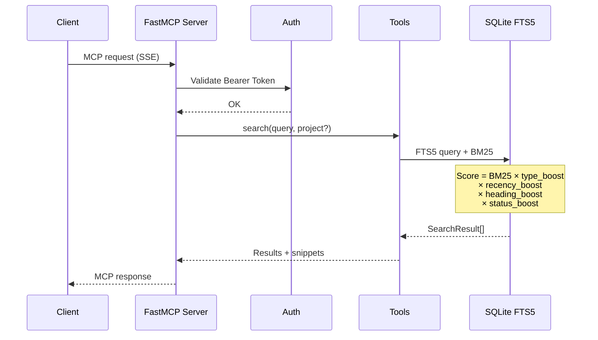
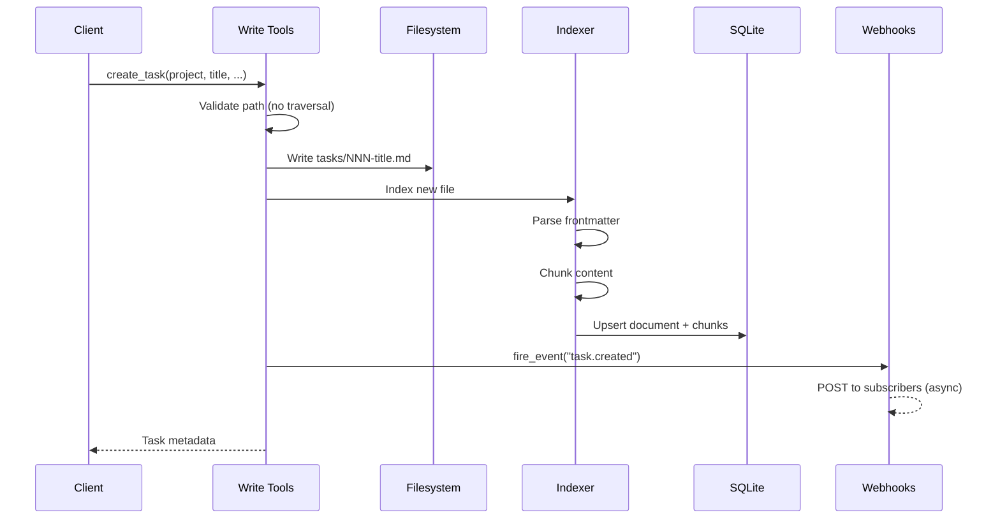
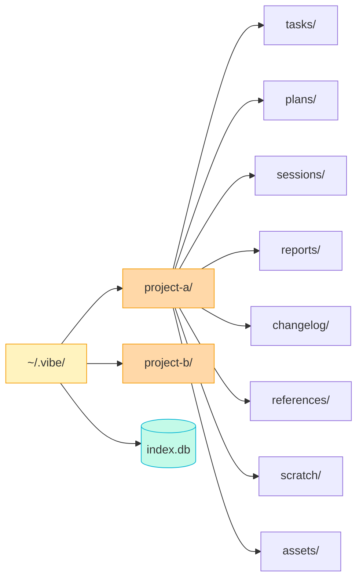

# vibeMCP — Architecture Diagram

## Component Overview

## Search Flow

## Write Flow (Create Task)

## Filesystem Structure

## Search Scoring

| Boost | Factor | Values |
|-------|--------|--------|
| **Type** | Folder location | tasks: 2.0, plans: 1.8, sessions: 1.5, scratch: 0.5 |
| **Recency** | Document age | 0-1d: 2.0, 2-7d: 1.5, 8-30d: 1.2, 90+d: 0.8 |
| **Heading** | Priority sections | "Current Status", "Blockers": 2.5, others: 1.0 |
| **Status** | Task state | in-progress: 2.0, blocked: 1.8, done: 0.6 |

> `final_score = BM25 × type × recency × heading × status`
