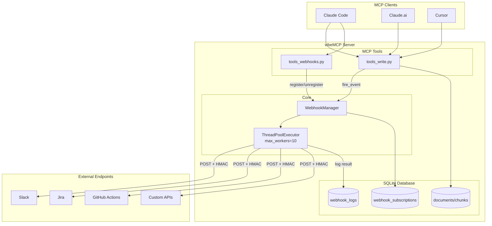
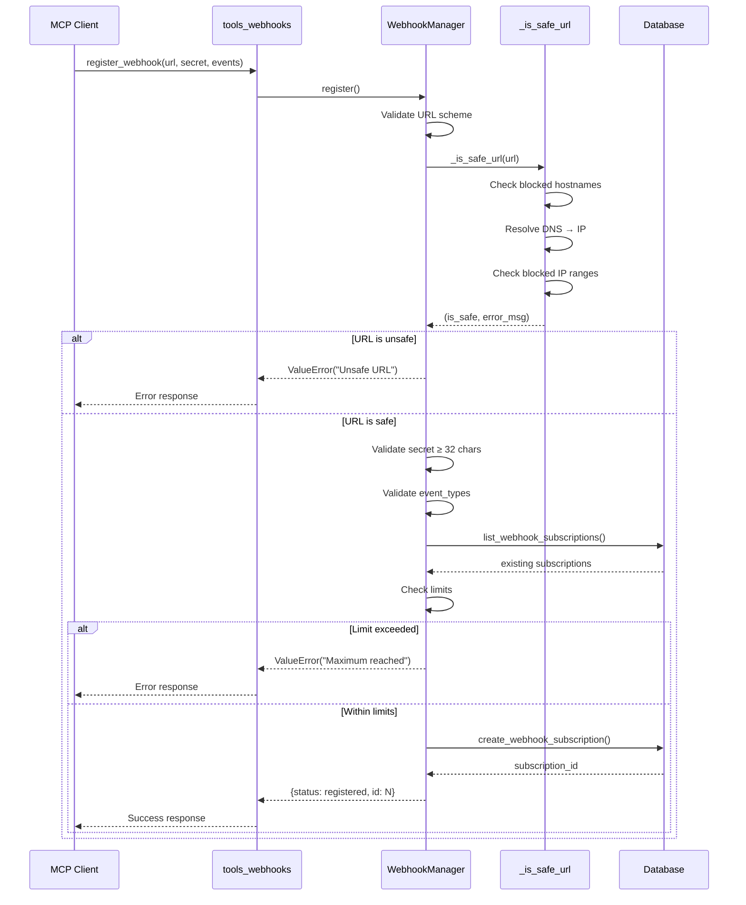
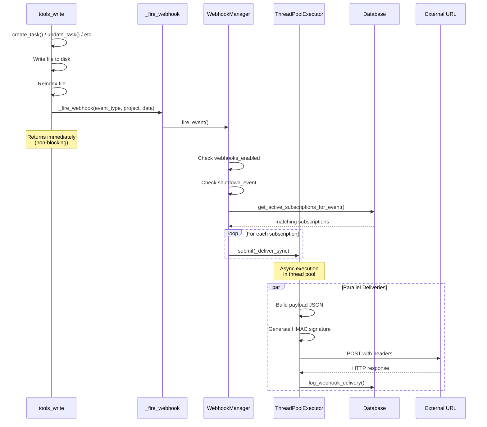
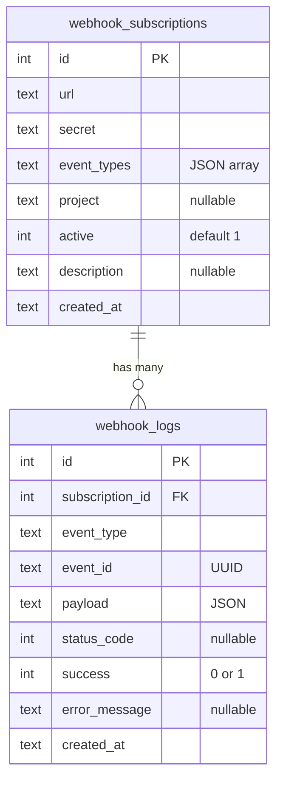
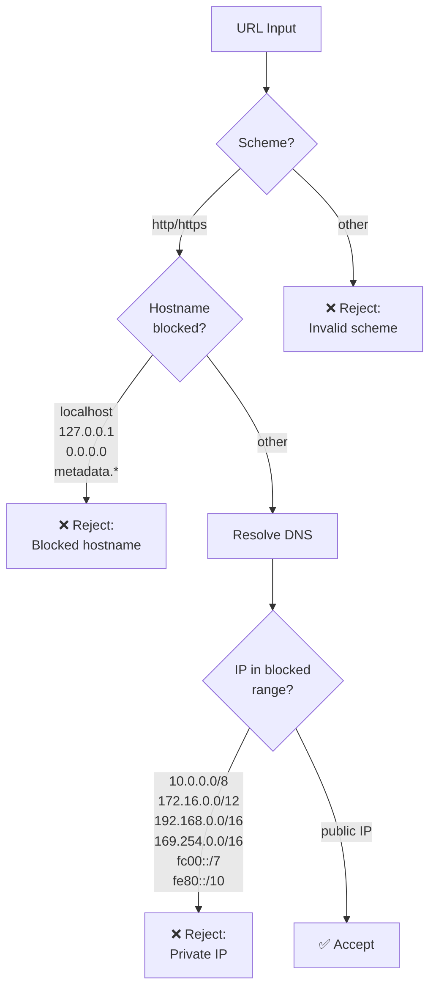
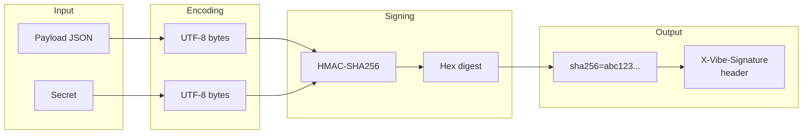
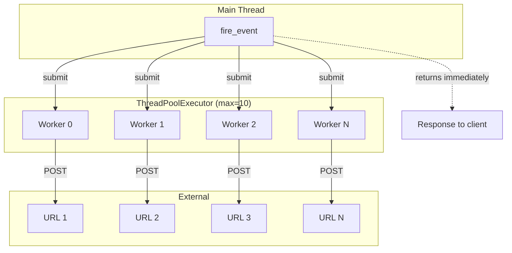
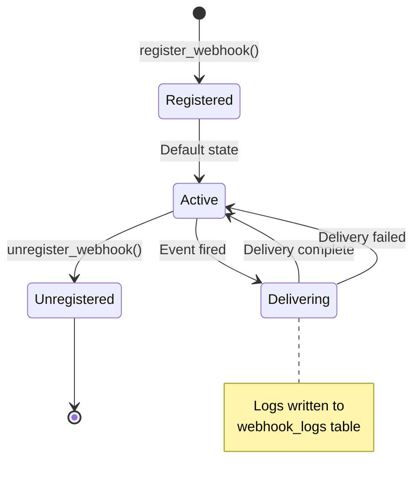
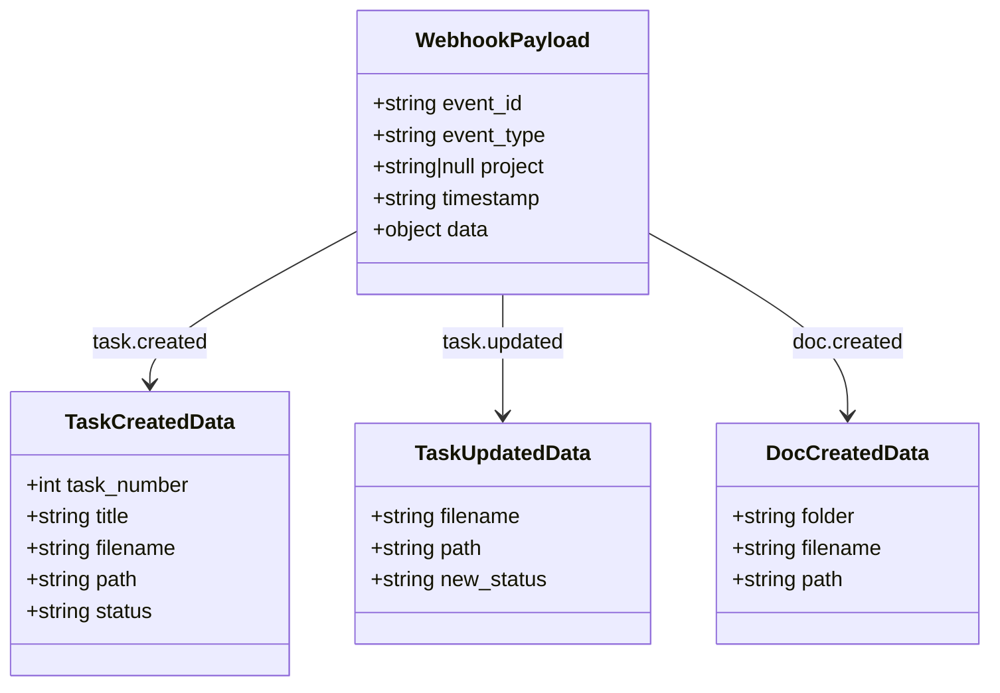
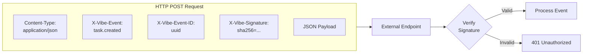

# Diagramas del Sistema de Webhooks

Diagramas en formato Mermaid para visualización en GitHub/GitLab.

## Arquitectura General

## Flujo de Registro de Webhook

## Flujo de Disparo de Evento

## Estructura de Base de Datos

## Validación SSRF

## Proceso de Firma HMAC

## Modelo de Concurrencia

## Estados del Ciclo de Vida

## Payload de Evento

## Headers HTTP

